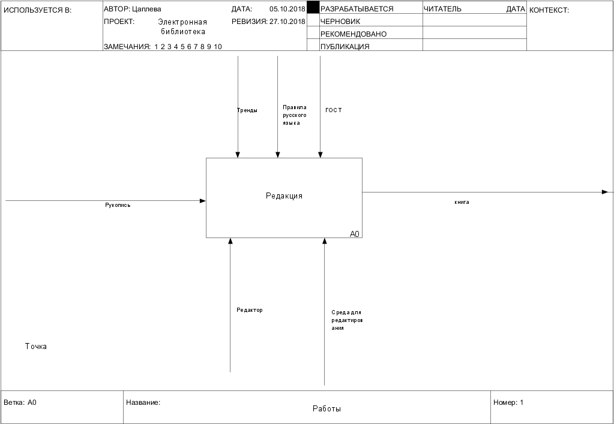
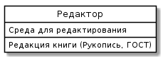
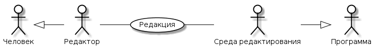

**Отчет о лабораторных работах** 
**Студент группы [ИДБ-15-12]**(https://github.com/stankin/design-2018/wiki/list-idb-15-12) Цаплева О. А. 
**Лабораторная 1** 
<li> [ссылка idef0 шесть вопросов](http://127.0.0.1:62622/idef0/index.html?id=3)
 
[ссылка диаграммы классов](http://www.plantuml.com/plantuml/png/JOzDIiH048NNqwSePgNW8SRn0kvSDzsDqqnFMgeJN8WG5Lm9MRYNn1E8Fn0YnYkylf4LiZ2Rehxt7e-gJIerbzKXgBJtnPLcVI0JT4fqerPRRVQN7Al2diKGcIvsldHgTSeShsTb6oGYmSZMyLAwLNFB6Ys-y8at3FaUOwxNf1ETIpkXo_NiaOplt93mVxON6l4kz2DxenP5ZvD062O77-Zf26r-41xnAzPTVZeXFEC57LwFvPITjuwCPnESshZ2ohj_) 
 
[ссылка диаграммы прецедентов](http://www.plantuml.com/plantuml/png/fO_1IiD048RFdQSOSj93mGSGQUeva9ld9LdRfPkip4xmO8NWmQkFe9wybgeWLViCks_awAPIl4f8yk___VCpE_6iYBl6Wb-OzaAHQb1Lx0YlO3HLrM96hclhKsV5EfiRrZ3AYTnbSgPM8X9qL6lQjwxt-ZglA-NrlnkjFcTaXsHcSyRQaAxOk1RIlkKHAezPU0gluJrimrh-cso0nG3lOo_eMRwhy27FQXSe4t-GeHTXctWJjh7_7K_qCVQ9On93yEsdT2sdJz5t6UmkdFyjlKsynF4O3_93aFTR5Y3B7oz5bL28iJoHXM6Ysxfhx1S0)
 
**Лабораторная 2** 
IDEF0 (png) 
 
Определение надсистемы (среды функционирования) 
Plan-Do-Check (png)  
