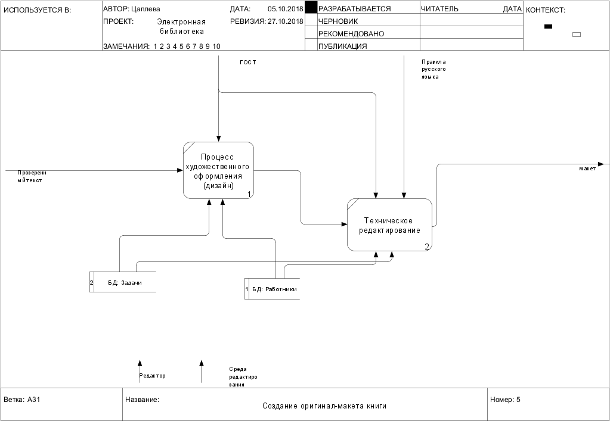

**Отчет о лабораторных работах** 
Студент группы [ИДБ-15-12](https://github.com/stankin/design-2018/wiki/list-idb-15-12) Цаплева О. А. 
**Лабораторная 1** 
Индивидуальное задание IDEF0 (png) 
 [ссылка idef0 шесть вопросов](http://127.0.0.1:62622/idef0/index.html?id=3) 
  
 [ссылка диаграммы классов](http://www.plantuml.com/plantuml/png/JOzDIiH048NNqwSePgNW8SRn0kvSDzsDqqnFMgeJN8WG5Lm9MRYNn1E8Fn0YnYkylf4LiZ2Rehxt7e-gJIerbzKXgBJtnPLcVI0JT4fqerPRRVQN7Al2diKGcIvsldHgTSeShsTb6oGYmSZMyLAwLNFB6Ys-y8at3FaUOwxNf1ETIpkXo_NiaOplt93mVxON6l4kz2DxenP5ZvD062O77-Zf26r-41xnAzPTVZeXFEC57LwFvPITjuwCPnESshZ2ohj_) 
 
 [ссылка диаграммы прецедентов](http://www.plantuml.com/plantuml/png/fO_1IiD048RFdQSOSj93mGSGQUeva9ld9LdRfPkip4xmO8NWmQkFe9wybgeWLViCks_awAPIl4f8yk___VCpE_6iYBl6Wb-OzaAHQb1Lx0YlO3HLrM96hclhKsV5EfiRrZ3AYTnbSgPM8X9qL6lQjwxt-ZglA-NrlnkjFcTaXsHcSyRQaAxOk1RIlkKHAezPU0gluJrimrh-cso0nG3lOo_eMRwhy27FQXSe4t-GeHTXctWJjh7_7K_qCVQ9On93yEsdT2sdJz5t6UmkdFyjlKsynF4O3_93aFTR5Y3B7oz5bL28iJoHXM6Ysxfhx1S0)
 
**Лабораторная 2** 
IDEF0 (png) 
 
**Определение надсистемы (среды функционирования)** 
[Блок Plan-Do-Check](http://127.0.0.1:55093/idef0/index.html?id=4)  
 
[Блок Check](http://127.0.0.1:55093/idef0/index.html?id=24) 
 
**Лабораторная 3** 
[Блок Создание оригинал-макета книги](http://127.0.0.1:55093/idef0/index.html?id=58) 
 

[Блок Создание оригинал-макета книги](http://127.0.0.1:55093/idef0/index.html?id=58) 
 
### Лабораторная работа №4
***
### Определение основных средств автоматизации
Определение требований к модели
* Формальное определение объекта моделирования (процесса) - построение функционально-воксельной модели рельефа
* Формальное определение точки зрения (владелец, руководитель) - разработчик
* Формальное определение цели моделирования (вопросы к модели) - визуализация довольно сложного процесса построения функционально-воксельной модели.
* Формальное определение темы курсового проекта (наименование информационной системы) - Система для выделения сложных форм рельефа

### Разработка диаграмм в RAMUS 
 [ссылка на диаграммы](http://127.0.0.1:51494/idef0/index.html?id=43&w=1024&h=768) 

* Контекстная диаграмма А0 - "построение функционально-воксельной модели рельефа"

* Декомпозиция диаграммы уровня А0 на четыре блока

* Декомпозиция блока А2 "Триангуляция Делоне"

* Декомпозиция блока А3 "Билинейная интерполяция"

* Декомпозиция блока А4 "Построение М-образов"

